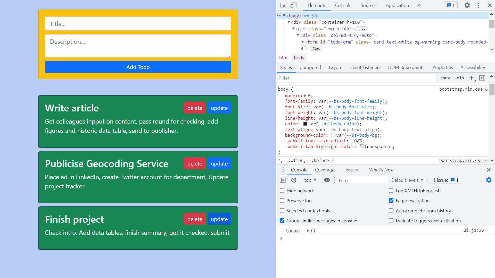

# :zap: Node Websockets CRUD

* A Node.js app to Create, Read, Update and Delete (CRUD) todo cards using Websockets
* Tutorial code from [Fazt](https://www.youtube.com/c/FaztTech/videos) with changes to code and styling
* **Note:** to open web links in a new window use: _ctrl+click on link_


## :page_facing_up: Table of contents

* [:zap: Node Websockets CRUD](#zap-node-websockets-crud)
  * [:page_facing_up: Table of contents](#page_facing_up-table-of-contents)
  * [:books: General Info](#books-general-info)
  * [:camera: Screenshots](#camera-screenshots)
  * [:signal_strength: Technologies](#signal_strength-technologies)
  * [:floppy_disk: Setup](#floppy_disk-setup)
  * [:computer: Code Examples](#computer-code-examples)
  * [:clipboard: Status & To-Do List](#clipboard-status--to-do-list)
  * [:clap: Inspiration](#clap-inspiration)
  * [:file_folder: License](#file_folder-license)
  * [:envelope: Contact](#envelope-contact)

## :books: General Info

* Socket.IO enables realtime, bi-directional communication between the client and server, with a client-side library that runs in the browser, and a server-side library for Node.js.
* uuid npm module provides each todo with a Universally Unique IDentifier (UUID) RN Namespace (doc. Number RF4122)
* The 16 octets of a UUID are represented as 32 hexadecimal (base-16) digits, displayed in five groups separated by hyphens, in the form 8-4-4-4-12 eg: "ee0a1fb5-fd31-4962-bf48-bdbe5dba1bd2"
* Bootstrap cards used with simple styling

## :camera: Screenshots

.

## :signal_strength: Technologies

* [Node.js v14](https://nodejs.org/) javascript runtime using the [Chrome V8 engine](https://v8.dev/).
* [Babel v7](https://babeljs.io/) JS compiler
* [Express v4](https://www.npmjs.com/package/express) web framework for node
* [Socket.io v4](https://www.npmjs.com/package/socket.io) to enable real-time bidirectional event-based communication.
* [uuid v8](https://www.npmjs.com/package/uuid) to create of RFC4122 UUIDs
* [Bootstrap v5](https://getbootstrap.com/) front-end open source toolkit
* [JSDoc](https://jsdoc.app/tags-param.html) @param tags used to provide the name, type, and description of a function parameter.
* [ncp v2](https://www.npmjs.com/package/ncp) asynchronous recursive file & directory copying

## :floppy_disk: Setup

* `npm run dev` to start a dev server on `localhost:3000`
* `npm run build` to create a build folder using Babel JS compiler
* `npm start` to run production version on `http://localhost:3000`

## :computer: Code Examples

* `sockets.js` websocket functions to create, read, update & delete todos.

```javascript
export default (io) => {
	io.on('connection', (socket) => {
    console.log('user connected');

		// Send todos to all connected sockets
		socket.emit('server:loadtodos', todos);

    // add new todo to existing todos array using push operator
		socket.on('client:newtodo', (newTodo) => {
			const todo = { id: uuid(), ...newTodo  };
			todos.unshift(todo);
			io.emit('server:newtodo', todo);
		});

    // filter todos to remove todo with id matching delete command
    // then rerender todos
		socket.on('client:deletetodo', (todoId) => {
			todos = todos.filter((todo) => todo.id !== todoId);
			io.emit('server:loadtodos', todos);
		});

    // fetch todo to be edited using find function where ids match
		socket.on('client:gettodo', (todoId) => {
			const todo = todos.find((todo) => todo.id === todoId);
			socket.emit('server:selectedtodo', todo);
		});

    // update todo using new data for todo where ids match
		socket.on('client:updatetodo', (updatedTodo) => {
			todos = todos.map((todo) => {
				if (todo.id === updatedTodo.id) {
					todo.title = updatedTodo.title;
					todo.description = updatedTodo.description;
				}
				return todo;
			});
			io.emit('server:loadtodos', todos);
		});

		socket.on('disconnect', () => {
			console.log(socket.id, 'disconnected');
		});
	});
};
```

## :clipboard: Status & To-Do List

* Status: Working
* To-Do: Nothing

## :clap: Inspiration

* [Fazt Code: Nodejs Socketio CRUD](https://www.youtube.com/watch?v=zWax5QCWCXM) in Spanish
* [socket.io documentation](https://socket.io/get-started/chat)

## :file_folder: License

* N/A

## :envelope: Contact

* Repo created by [ABateman](https://github.com/AndrewJBateman), email: gomezbateman@yahoo.com
